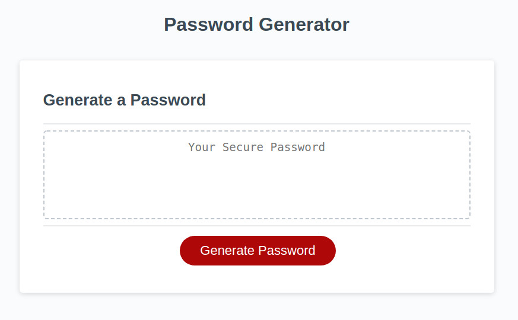

# Homework week 3 | Password Generator

This week I was tasked with making a password generator that takes in user input and crafts a random password.

## Some features of the password generator:

* User selects the password length (between 8-128)
* The can choose any of the following character types:
   * lowercase
   * uppercase
   * numeric
   * special characters
* After they select the above, a password is generated that matches their criteria and is displayed on the page

## Screenshot of the Password Generator app

## Link to Password Generator app:

Link to my [Password Generator app](https://murda02.github.io/homework-week-3-dlm/)

## Author

    Dave Murphy